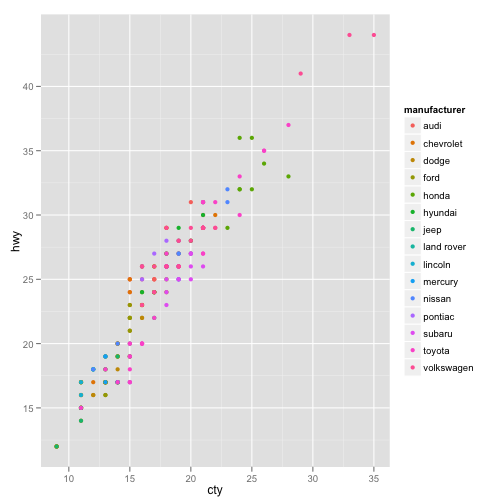

# A test document
## Sub heading
### Sub sub heading
Today is `2012-03-20`


This document is a test to see how well the pandoc to pdf conversion is.


```r
rnorm(5)
```


```
## [1] -2.2618 -0.8726  0.3695  1.6229 -0.8568
```


```r
sqrt(-1)
```


```
## Warning message: NaNs produced
```


```
## [1] NaN
```


  


```r
ggplot(mpg) + geom_point(aes(cty, hwy, colour = manufacturer))
```

 

